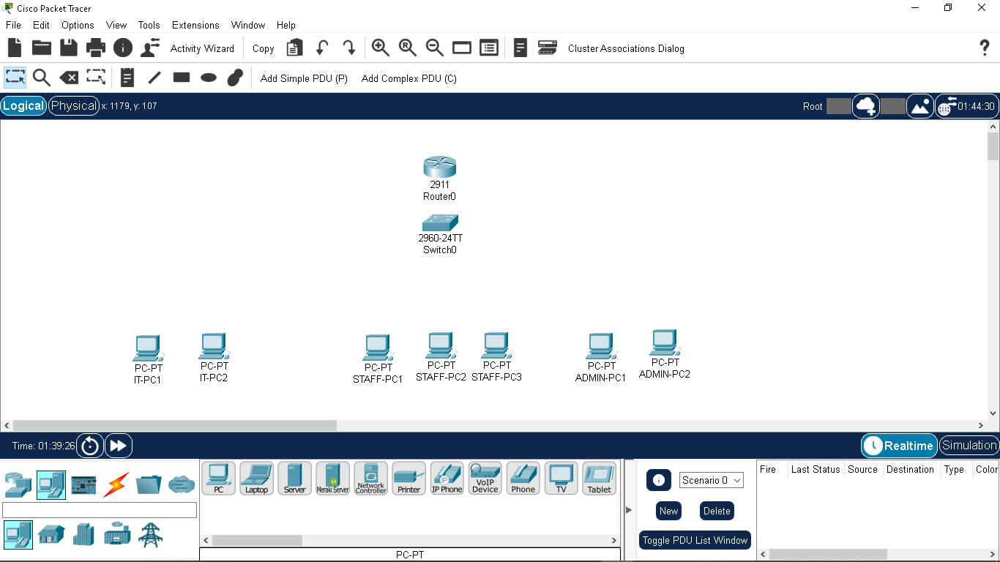
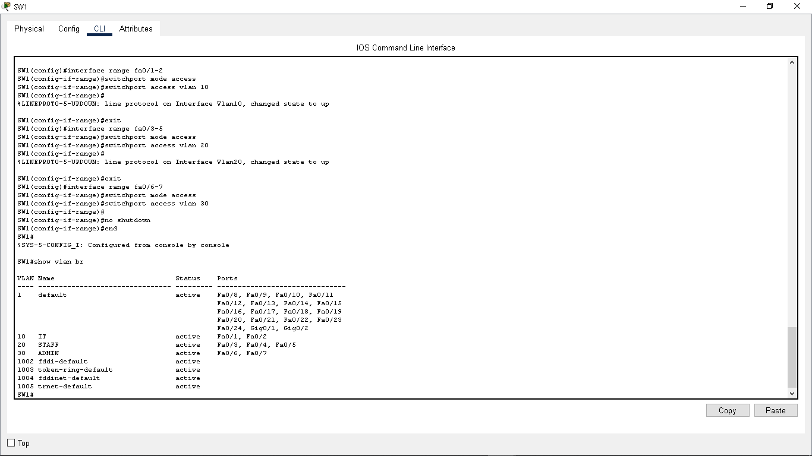
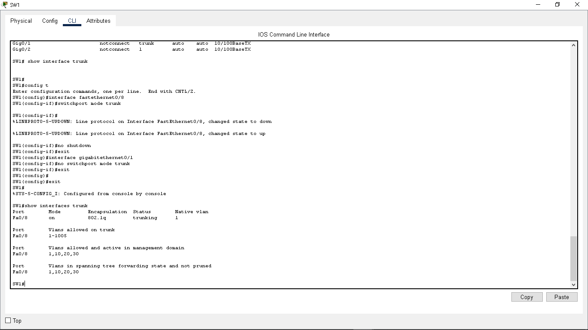
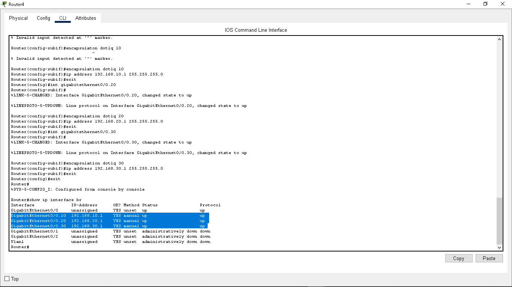
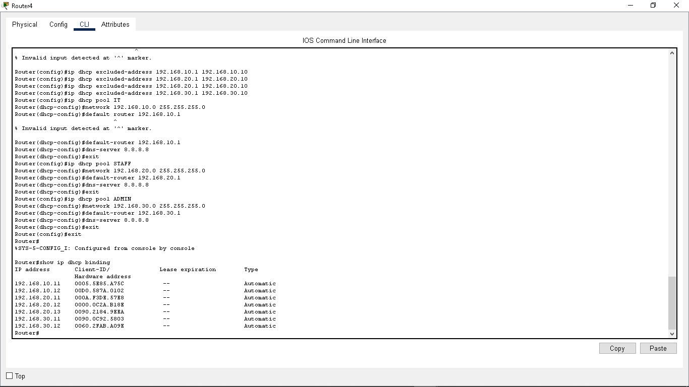
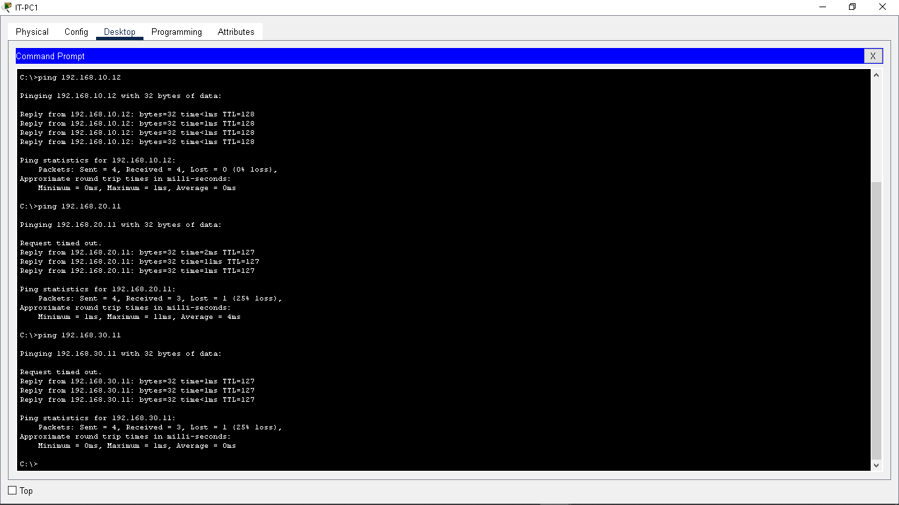
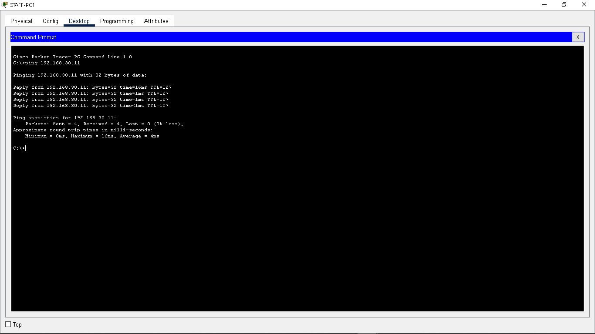
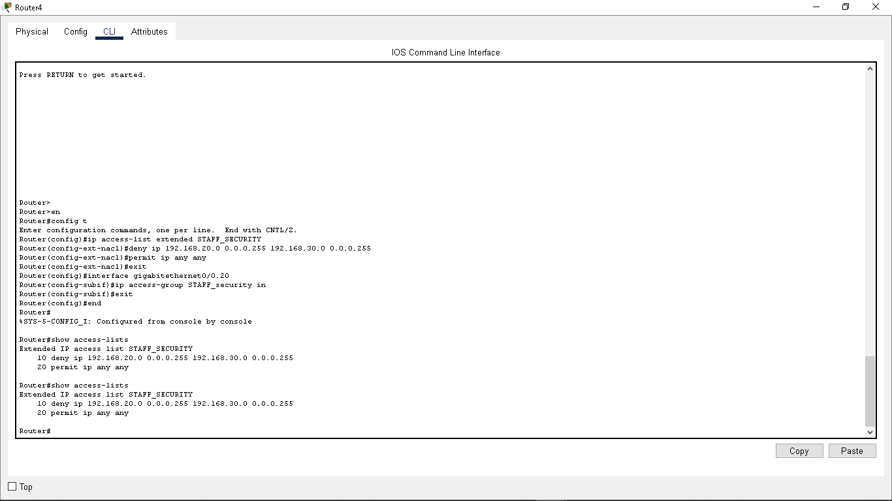
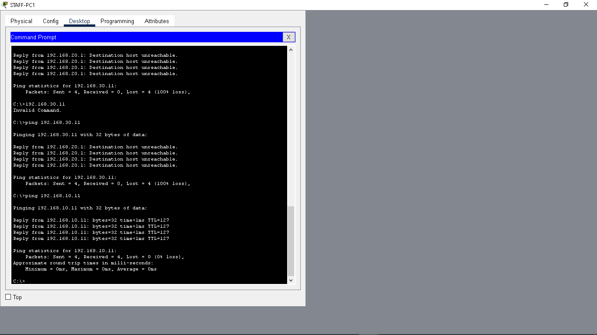

# Secure Small Business Network

## Project Overview

This project demonstrates the design, configuration, security, and troubleshooting of a small business network using Cisco Packet Tracer.

The network was designed for three departments: IT, Staff, and Administration. Each department was placed in a separate VLAN to provide network segmentation.

Router-on-a-stick was implemented to provide inter-VLAN routing, while DHCP was configured to automatically provide IP addressing to end devices.

An extended Access Control List (ACL) was then implemented to restrict Staff devices from accessing the Administration network while maintaining permitted communication with the IT network.

## Network Architecture

The network consists of:

- 1 Cisco router
- 1 Cisco 2960 switch
- 7 end-user PCs
- 3 VLANs
- 802.1Q trunking
- Router-on-a-stick
- DHCP
- Extended ACL security controls

## VLAN and IP Addressing Design

| VLAN | Department | Network | Default Gateway |
|------|------------|---------|-----------------|
| 10 | IT | 192.168.10.0/24 | 192.168.10.1 |
| 20 | STAFF | 192.168.20.0/24 | 192.168.20.1 |
| 30 | ADMIN | 192.168.30.0/24 | 192.168.30.1 |

## Network Configuration

### VLAN Segmentation

Three VLANs were created on the Cisco switch:

- VLAN 10 — IT
- VLAN 20 — STAFF
- VLAN 30 — ADMIN

Switch access ports were assigned according to department.

### 802.1Q Trunking

The connection between the switch and router was configured as an 802.1Q trunk, allowing traffic from VLANs 10, 20, and 30 to travel across a single physical connection.

### Inter-VLAN Routing

Router-on-a-stick was configured using router subinterfaces:

- G0/0.10 — 192.168.10.1
- G0/0.20 — 192.168.20.1
- G0/0.30 — 192.168.30.1

This allows the router to route traffic between the three VLANs.

## DHCP Configuration

Separate DHCP pools were configured for each department.

The router automatically assigns:

- IPv4 addresses
- Subnet masks
- Default gateways
- DNS server information

Addresses from `.1` through `.10` were excluded from each DHCP pool to reserve them for infrastructure and other statically addressed devices.

## Security Implementation

An extended ACL named `STAFF_SECURITY` was created to prevent devices on the STAFF network from accessing the ADMIN network.

Security policy:

`STAFF → ADMIN = DENY`

`STAFF → IT = PERMIT`

Other IP traffic is permitted by the ACL.

The ACL was applied inbound to the VLAN 20 router subinterface.

## Security Testing

Before implementing the ACL, STAFF-PC1 was able to successfully communicate with ADMIN-PC1.

After implementing the security policy:

- STAFF → ADMIN: Blocked
- STAFF → IT: Successful

This confirmed that the ACL restricted the intended traffic without unnecessarily disrupting other permitted network communication.

## Troubleshooting

During implementation, the switch trunk was initially configured on GigabitEthernet0/1.

Using:

`show interfaces status`

I identified that the router was actually connected to FastEthernet0/8.

The trunk configuration was moved to the correct interface and verified using:

`show interfaces trunk`

A second troubleshooting exercise occurred while implementing the ACL. Connectivity testing showed that STAFF devices could still reach the ADMIN network. I verified the PC addressing, router subinterface, ACL configuration, and ACL placement before correcting the applied ACL configuration and retesting the security policy.

## Verification Commands

Commands used to verify the network included:

`show vlan brief`

`show interfaces trunk`

`show ip interface brief`

`show ip dhcp binding`

`show access-lists`

`show ip interface gigabitEthernet0/0.20`

`ping`

`ipconfig`

## Skills Demonstrated

- Cisco IOS CLI
- VLAN configuration
- Network segmentation
- IPv4 subnetting
- DHCP configuration
- 802.1Q trunking
- Router-on-a-stick
- Inter-VLAN routing
- Extended Access Control Lists
- Network security
- Connectivity testing
- Network troubleshooting
- Cisco Packet Tracer

## Lab File

The complete Cisco Packet Tracer `.pkt` file is included in this repository so the network configuration can be reviewed and tested.
## Project Evidence

The following screenshots document the configuration, verification, testing, and security controls implemented during this lab.

### 1. Network Topology

The completed Packet Tracer topology contains a Cisco router, Cisco 2960 switch, and seven end-user devices separated into IT, STAFF, and ADMIN departments.

### 2. VLAN Segmentation

VLANs 10, 20, and 30 were created for the IT, STAFF, and ADMIN departments, with the appropriate switch access ports assigned to each VLAN.

### 3. 802.1Q Trunk Verification

The switch-to-router connection was configured as a trunk carrying VLANs 10, 20, and 30.

### 4. Router-on-a-Stick Configuration

Router subinterfaces provide the default gateways and inter-VLAN routing for each network.

### 5. DHCP Address Allocation

DHCP was configured for all three VLANs, allowing end devices to obtain their IPv4 configuration dynamically.

### 6. Inter-VLAN Connectivity Testing

Connectivity tests were performed to verify successful routing between the VLANs before security restrictions were applied.

### 7. Connectivity Before ACL Enforcement

Before the security restriction was enforced, the STAFF network was able to communicate with the ADMIN network.

### 8. Extended ACL Configuration

The `STAFF_SECURITY` extended ACL was configured to deny traffic originating from the STAFF subnet and destined for the ADMIN subnet while permitting other IP traffic.

### 9. Security Policy Verification

After ACL implementation, testing confirmed that STAFF devices could still communicate with the IT network while communication from STAFF to ADMIN was blocked.

---

## Project Outcome

This project demonstrates practical experience designing and troubleshooting a segmented network rather than only studying networking concepts theoretically. The completed lab combines switching, routing, DHCP, VLAN segmentation, access control, connectivity testing, and systematic troubleshooting in a single network environment.
